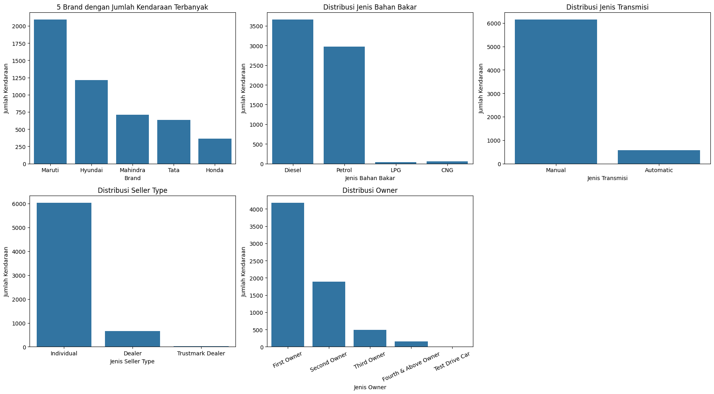
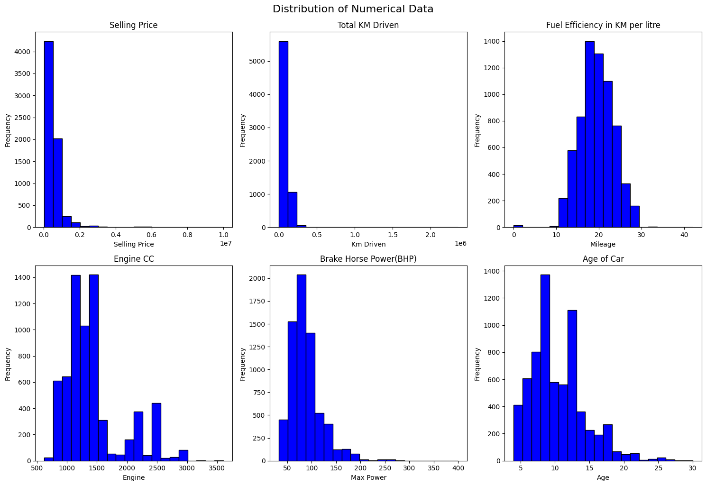
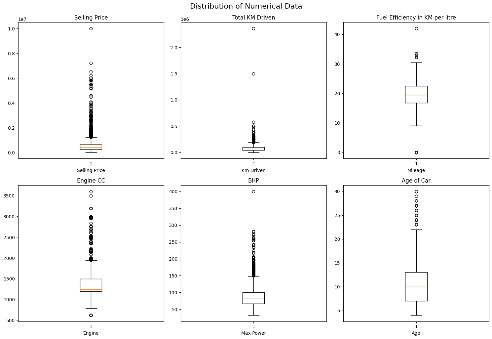
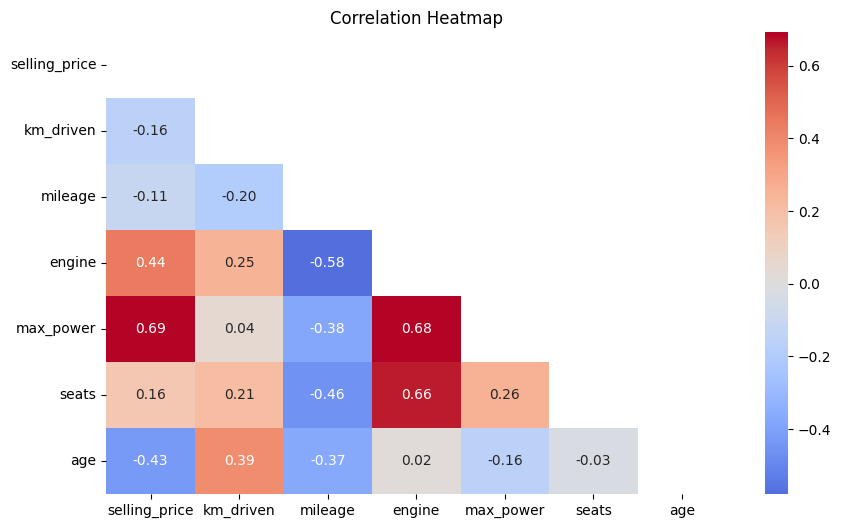
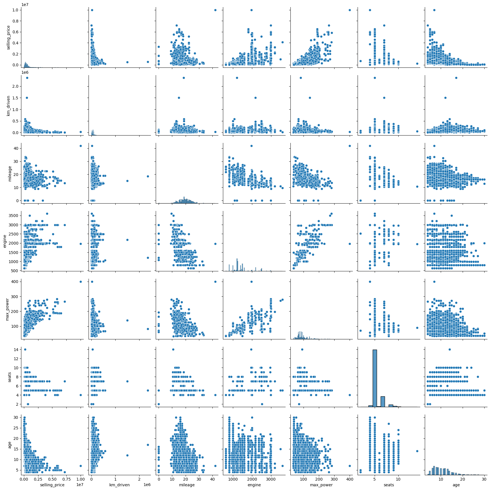
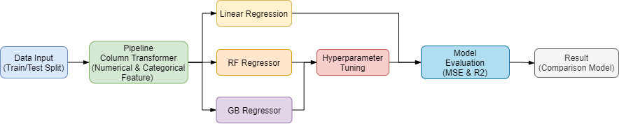
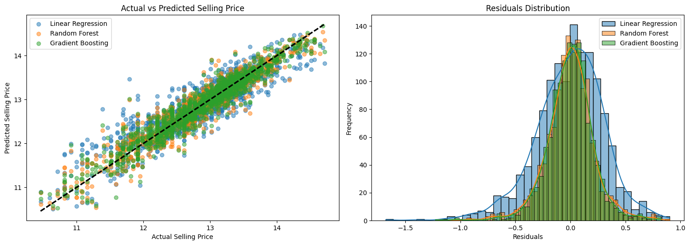
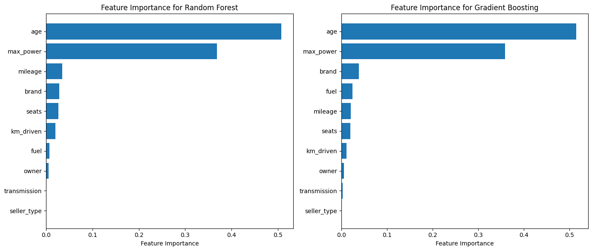

# Laporan Proyek Machine Learning - Car Price Prediction by Maulana Kavaldo

## Domain Proyek

### Latar Belakang:
Industri otomotif memiliki peran penting dalam ekonomi global [^1]. Salah satu tantangan terbesar yang dihadapi oleh industri ini adalah penentuan harga jual kendaraan. Dengan banyaknya faktor yang mempengaruhi harga kendaraan, seperti usia kendaraan, merek, jumlah kilometer yang telah ditempuh, jenis bahan bakar, dan banyak lagi, penting bagi penjual dan pembeli untuk memiliki alat yang dapat memprediksi harga jual dengan akurasi tinggi dan memperhatikan hasil evaluasi model [^2]. Penentuan harga yang tidak akurat dapat merugikan baik penjual maupun pembeli.

### Mengapa Masalah Ini Penting?
Memprediksi harga jual kendaraan dengan akurat memungkinkan pelaku industri otomotif untuk membuat keputusan yang lebih baik dan mengurangi kerugian finansial. Dengan menggunakan metode machine learning, kita dapat membangun model prediktif yang mampu memperkirakan harga jual berdasarkan fitur-fitur kendaraan yang relevan [^3] [^4].

## Business Understanding

### Problem Statements

1. Bagaimana model machine learning dapat digunakan untuk memprediksi harga jual kendaraan bekas berdasarkan fitur-fitur yang tersedia?
2. Fitur mana yang paling mempengaruhi harga jual kendaraan?
3. Algoritma mana yang memberikan hasil prediksi paling akurat atau lebih mendekati untuk kasus ini?

### Goals

1. Membuat model prediktif untuk memperkirakan harga jual kendaraan bekas.
2. Mengidentifikasi fitur-fitur yang paling mempengaruhi harga jual.
3. Membandingkan beberapa algoritma untuk menentukan model terbaik.

### Solution statements
1. Menggunakan Linear Regression, Random Forest Regressor, dan Gradient Boosting untuk membangun model prediktif.
2. Melakukan hyperparameter untuk meningkatkan kinerja model yang dihasilkan.
3. Mengevaluasi model berdasarkan metrik Mean Squared Error (MSE) dan R-squared (R^2) untuk memilih model terbaik.

## Data Understanding

### Deskripsi Dataset:
Dataset yang digunakan dalam proyek ini adalah [Vehicle Dataset from Cardekho](https://www.kaggle.com/datasets/nehalbirla/vehicle-dataset-from-cardekho), yang terdiri dari 8128 entri dengan 13 kolom. Dataset ini berisi informasi tentang berbagai fitur kendaraan, termasuk tahun produksi, harga jual, jarak tempuh, jenis bahan bakar, dan lainnya.

### Sumber Dataset:
Dataset dapat diunduh dari [Kaggle - Vehicle Dataset from Cardekho](https://www.kaggle.com/datasets/nehalbirla/vehicle-dataset-from-cardekho).

### Fitur-Fitur dalam Dataset:

- name: Nama kendaraan
- year: Tahun pembuatan
- selling_price: Harga jual kendaraan
- km_driven: Jumlah kilometer yang telah ditempuh
- fuel: Jenis bahan bakar
- seller_type: Tipe penjual
- transmission: Jenis transmisi
- owner: Status kepemilikan
- mileage: Efisiensi bahan bakar
- engine: Kapasitas mesin
- max_power: Daya maksimum
- torque: Torsi
- seats: Jumlah kursi

### Fitur tambahan hasil Feature Engineering:
- brand: Merek kendaraan
- age: Usia kendaraan (tahun sekarang dikurangi tahun pembuatan)

### Exploratory Data Analysis (EDA):

1. Distribusi data kategorikal.

    

    Pada grafik menunjukkan lima merek kendaraan dengan jumlah terbanyak, dengan merek teratas memiliki sekitar 2000 kendaraan. 

    Kendaraan lebih didominasi berbahan bakar diesel dan petrol.

    Jenis transmisi manual jauh lebih dominan dibandingkan otomatis, mencapai hampir 10.000 kendaraan.

2. Distribusi data numerical

    

    Distribusi harga jual mobil menunjukkan skewness positif, dengan sebagian besar mobil dijual dengan harga lebih rendah dan beberapa dengan harga sangat tinggi. Kapasitas mesin mobil cenderung simetris atau sedikit skewness negatif, menunjukkan distribusi yang merata. Pada BAP juga menunjukkan skewness positif, dengan sebagian besar mobil memiliki tenaga kuda yang lebih rendah. Efisiensi bahan bakar memiliki skewness negatif, menunjukkan sebagian besar mobil memiliki efisiensi yang baik. Usia mobil menunjukkan skewness positif, dengan sebagian besar mobil berusia lebih muda.

3. Outlier Detection:

    

    Sebagian besar variabel menunjukkan adanya outliers, yang berarti ada kendaraan-kendaraan tertentu yang sangat berbeda dari mayoritas lainnya dalam hal harga jual, jarak tempuh, efisiensi bahan bakar, kapasitas mesin, tenaga mesin, dan umur.

    Mayoritas data cenderung terkonsentrasi pada rentang yang lebih rendah, dengan distribusi yang memanjang di arah yang lebih tinggi, terutama untuk variabel seperti harga jual, jarak tempuh, dan kapasitas mesin.

4. Heatmap Korelasi

    

    Tidak terlihat adanya korelasi yang cukup besar pada data. Sehingga tidak diperlukan penghapusan atau pengurangan fitur.

5. Hubungan dua variabel secara bersamaan dan pola distribusi antara beberapa variabel.

    

## Data Preparation

### Proses Data Preparation:

1. Menghapus data yang terdapat missing value dan data duplikat.
2. Menghapus kolom data torque dari dataset
3. Menghapus unit (satuan) pada data mileage, engine dan max_power.
4. Melakukan filter agar outlier tidak masuk ke dalam pemodelan.
5. Menambahkan dua fitur baru, yaitu brand yang diambil dari name, dan age yang dihitung dari perbedaan antara tahun sekarang dengan year.
6. Data dibagi menjadi 80% untuk pelatihan (training) dan 20% untuk pengujian (testing). Ini dilakukan menggunakan fungsi train_test_split, di mana variabel independen (fitur) disimpan di dalam X, dan variabel dependen (target) disimpan di dalam y.
7. Mengonversi variabel kategorikal seperti fuel, seller_type, transmission, dan owner ke dalam format numerik menggunakan OrdinalEncoder agar dapat menampilkan feature importance.

### Alasan untuk Tahapan Data Preparation:

1. Data yang mengandung missing value dan duplikat perlu dihapus untuk menjaga integritas data dan menghindari bias pada model.
2. Data torque dihapus karena kurang mempresentasikan nilai yang tepat.
3. Menjadikan kolom mileage, engine dan max_power menjadi data numerik
4. Menghapus outlier dari dataset sebelum pemodelan membantu meningkatkan akurasi dan kestabilan model, mengurangi bias dan varians, serta memastikan asumsi model dipenuhi untuk hasil yang lebih representatif dan dapat diandalkan.
5. Feature engineering bertujuan untuk menambahkan informasi tambahan yang relevan dan dapat meningkatkan performa model.
6. Pembagian 80:20 cukup umum digunakan. Pembagian ini memastikan model dapat belajar dari sebagian besar data dan diuji pada data baru untuk mengevaluasi performanya. Ini membantu mengukur seberapa baik model generalisasi terhadap data yang tidak terlihat sebelumnya.
7. Encoding variabel kategorikal diperlukan karena algoritma machine learning tidak dapat bekerja langsung dengan data non-numerik.

## Modeling

 

Setelah data melalui tahap preprocessing, kemudian masuk dalam modeling dengan tahapan:

1. Pada uji coba dilakukan dengan 3 model regresi dengan dan tanpa hyperparameter (GridSearch). Untuk para meter yang digunakan akan dijelaskan pada sub improvement mengenai parameter-parameter apa saja yang digunakan.

    - Linear Regression
    - Random Forest
    - Gradient Boosting

2. Untuk setiap model, pipeline dilatih (fit) menggunakan data pelatihan (X_train, y_train), lalu digunakan untuk memprediksi (predict) nilai dari data pengujian (X_test). Hasil prediksi dievaluasi dengan menghitung nilai Mean Squared Error (MSE) dan koefisien determinasi (R²) untuk mengukur seberapa baik model tersebut.

3. Semua hasil evaluasi dikumpulkan dalam bentuk DataFrame (results_df) yang menyajikan perbandingan performa model-model tersebut berdasarkan MSE dan R².

### Model Machine Learning:

1. Linear Regression: Algoritma dasar untuk regresi yang sederhana dan cepat.
      - Kelebihan: Mudah diinterpretasikan.
      - Kekurangan: Rentan terhadap multikolinearitas dan outlier.

2. Random Forest Regressor: Algoritma ensemble yang menggunakan banyak decision tree.
      - Kelebihan: Mengurangi overfitting, baik dalam menangani data non-linear.
      - Kekurangan: Lebih kompleks dan memerlukan lebih banyak sumber daya komputasi.

3. Gradient Boosting: Algoritma ensemble yang membangun model secara bertahap.
    - Kelebihan: Sangat kuat dan akurat.
    - Kekurangan: Membutuhkan tuning yang cermat untuk menghindari overfitting.

### Improvement:

Untuk setiap model, dilakukan tuning hyperparameter menggunakan GridSearchCV kecuali Linear Regression untuk mencari kombinasi terbaik. Karena model Linear Regression tidak mendukung GridSearch. Parameter yang digunakan pada proyek ini yaitu:

1. Linear Regression

    Untuk model regresi linier, tidak ada parameter yang perlu di-tune karena model ini tidak memiliki hyperparameter yang dapat diubah untuk mengubah kompleksitas atau performanya. Model ini menggunakan parameter default yang sudah diatur dalam algoritma regresi linier, sehingga tidak memerlukan pencarian hyperparameter tambahan.

2. Random Forest

    Parameter `regressor__n_estimators` menentukan jumlah pohon dalam hutan acak, dengan nilai yang diuji adalah **[50, 100, 200]**. Parameter ini mempengaruhi kekuatan model, di mana lebih banyak pohon dapat meningkatkan akurasi tetapi juga memerlukan lebih banyak waktu komputasi. 
    
    Parameter `regressor__max_depth` menentukan kedalaman maksimum dari setiap pohon, dengan nilai yang diuji meliputi **[None, 10, 20, 30]**. Kedalaman yang lebih besar memungkinkan model menangkap lebih banyak informasi, tetapi dapat meningkatkan risiko overfitting. 
    
    Parameter `regressor__min_samples_split` mengatur jumlah minimum sampel yang diperlukan untuk membagi node internal, dengan nilai yang diuji adalah **[2, 5, 10]**. Nilai ini mempengaruhi bagaimana pohon dibagi dan seberapa mendetail struktur pohon yang dibangun.

3. Gradient Boosting

    Parameter `regressor__n_estimators` menentukan jumlah estimator (pohon keputusan) dalam model boosting, dengan nilai yang diuji adalah **[50, 100, 200]**. Jumlah estimator mempengaruhi kekuatan model dan kemampuannya dalam menangkap pola data. 
    
    Parameter `regressor__learning_rate` mengatur kecepatan belajar model boosting, dengan nilai yang diuji meliputi **[0.01, 0.1, 0.2]**. Kecepatan belajar yang lebih rendah dapat meningkatkan akurasi model tetapi membutuhkan lebih banyak estimator. 
    
    Parameter `regressor__max_depth` menentukan kedalaman maksimum dari setiap pohon dalam model boosting, dengan nilai yang diuji adalah **[3, 5, 7]**. Kedalaman yang lebih besar dapat menangkap lebih banyak detail tetapi juga dapat menyebabkan overfitting.

### Prediksi dan Visualisasi:

Setelah dilakukan pemodelan sebelumnya, pada tahap ini dilakukan: 

1. Prediksi

    Untuk setiap model dalam dictionary models, pipeline dibuat menggunakan fungsi `create_pipeline`, kemudian model dilatih dengan data training (X_train, y_train). Setelah itu, model digunakan untuk memprediksi data testing (X_test), dan hasil prediksi disimpan dalam dictionary dengan nama model sebagai kunci.

2. Visualisasi:

    - **Plot 1 - Actual vs Predicted**

        Pada subplot yang ditampilkan ini, ditampilkan scatter plot yang membandingkan nilai aktual (y_test) dengan nilai prediksi (y_pred) untuk setiap model. Garis putus-putus (k--) menunjukkan garis diagonal yang ideal, di mana nilai prediksi sama dengan nilai aktual. Ini membantu untuk melihat seberapa dekat prediksi model dengan nilai sebenarnya.

        Berdasarkan grafik di atas, model Gradient Boosting (hijau) menunjukkan prediksi yang paling konsisten dengan garis referensi ideal (hitam putus-putus), diikuti oleh Random Forest (oranye). Linear Regression (biru) memiliki penyebaran yang lebih besar, menunjukkan lebih banyak kesalahan prediksi.

    - **Plot 2 - Residuals Distribution**

        Pada subplot kedua, distribusi residuals (selisih antara nilai aktual dan nilai prediksi) diplot menggunakan histogram dan kurva KDE (Kernel Density Estimation) untuk setiap model. Sehingga dapat memberikan gambaran tentang bagaimana residuals terdistribusi, apakah ada pola tertentu, atau apakah residuals terdistribusi secara acak di sekitar nol.

        Sehingga dari grafik tersebut bahwa distribusi residual dari ketiga model hampir normal, tetapi Gradient Boosting (hijau) memiliki distribusi residual yang paling terpusat, menunjukkan bias yang lebih rendah dan prediksi yang lebih akurat.

### Tujuan Visualisasi:

1. Actual vs Predicted

    Membantu mengevaluasi seberapa baik model memprediksi harga jual sebenarnya, dengan memeriksa seberapa dekat titik-titik prediksi dengan garis diagonal.

2. Residuals Distribution

    Menilai apakah model memiliki kesalahan yang terdistribusi secara merata, yang merupakan indikasi bahwa model mungkin tidak memiliki bias sistematik.

### Pemilihan Model Terbaik:
Dari ketiga model, model dengan nilai MSE terendah dan R^2 tertinggi akan dipilih sebagai model terbaik yang akan disimpulkan pada tahap kesimpulan.

## Evaluation

### Metrik Evaluasi:

1. Mean Squared Error (MSE): Mengukur rata-rata dari kuadrat kesalahan antara nilai aktual dan prediksi.
    - Formula: MSE = (1/n) Σ (y_actual - y_predicted)²
    - Interpretasi: Semakin rendah nilai MSE, semakin baik modelnya.

2. R-squared (R^2): Mengukur proporsi variansi dalam variabel dependen yang dapat dijelaskan oleh variabel independen.
    - Formula: R² = 1 - (Σ(y_actual - y_predicted)² / Σ(y_actual - y_mean)²)
    - Interpretasi: R^2 berkisar antara 0 hingga 1. Nilai mendekati 1 menunjukkan model yang baik.

### Hasil Evaluasi:

**Tanpa Grid Search**

| Model                        | MSE  | R²    |
|------------------------------|------|-------|
| Linear Regression            | 0.10 | 0.81 (81%) |
| Random Forest Regressor       | 0.05 | 0.91 (91%) |
| Gradient Boosting Regressor   | 0.05 | 0.91 (91%) |

**Grid Search**

| Model + Gridsearch           | MSE  | R²    |
|------------------------------|------|-------|
| Linear Regression            | 0.10 | 0.81 (81%) |
| Random Forest Regressor       | 0.05 | 0.91 (91%) |
| Gradient Boosting Regressor   | 0.04 | 0.92 (92%) |

**Feature Importance**

## Kesimpulan

- Model prediksi harga kendaraan menggunakan model Linear Reggresion, Random Forest Regressor dan Gradien Boosting Regressor berhasil dibuat.
- Terdapat 6 fitur penting pada model yaitu: age, max_power, mileage, brand, seats, dan km_driven.
- Berdasarkan hasil evaluasi dengan dan tanpa perbaikan menggunakan GridSearch, peningkatan kinerja model Gradient Boosting hanya selisih 1%. Hal ini menunjukkan bahwa model default saja sudah sangat baik dalam memberikan hasil terbaik, dengan nilai MSE yang rendah dan R² yang tinggi, sehingga dipilih sebagai model final untuk memprediksi harga jual kendaraan.

## Referensi

[^1]: Library Automotive of Congress. "Global Automobile Industry".  Retrieved from [https://guides.loc.gov/automotive-industry/global](https://guides.loc.gov/automotive-industry/global) at August 18th, 2024.

[^2]: Prabaljeet Singh Saini & Lekha Rani. "Performance Evaluation of Popular Machine Learning Models for Used Car Price Prediction". 2023. ICDAI. [Link Available](https://link.springer.com/chapter/10.1007/978-981-99-3878-0_49)

[^3]: Ahmad. Muhammad, et al. "Car Price Prediction using Machine Learning". 2024. IEEE. DOI: [10.1109/I2CT61223.2024.10544124](https://ieeexplore.ieee.org/abstract/document/10544124). [Link Available](https://ieeexplore.ieee.org/abstract/document/10544124)

[^4]: Jin. C. "Price Prediction of Used Cars Using Machine Learning". 2021. IEEE DOI: [10.1109/ICESIT53460.2021.9696839](https://ieeexplore.ieee.org/document/9696839). [Link Available](https://ieeexplore.ieee.org/document/9696839)
